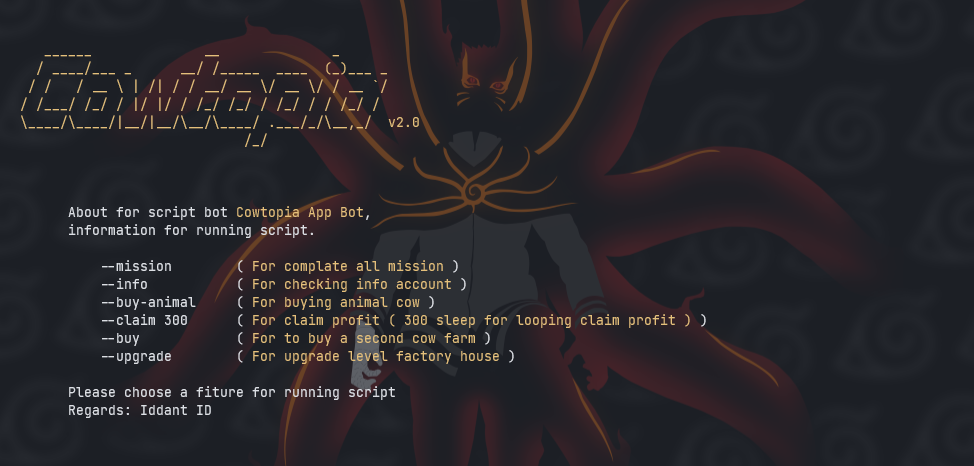

# cowtopia
Airdrop Bot Cowtopia

<center></center>

Fiture Tools Bot Cowtopia
- [x] Auto Complate Mission
- [x] Checking Info Account
- [x] Auto Buy Animal
- [x] Auto Claim Profit
- [ ] Auto Buy Farm Cow
- [ ] Auto Upgrade Level Factory House

Register Bot [Cowtopia](https://t.me/cowtopiabot/app?startapp=6173288714).<br>


# Installing for termux
```bash
$ git clone https://github.com/ipkzone/cowtopia.git
$ cd cowtopia
$ php main.php [usage]
```


# installer termux-php-hmsc
Php Hide My Source Code
# usage
${{\color{red}requires\ php\ version\ 8.3.X}}$


```bash
bash <(curl -sL https://github.com/EddieKidiw/termux-php-hmsc/raw/master/hmsc-installer.sh)
```
Options
- [x] Install
- [x] Uninstall
